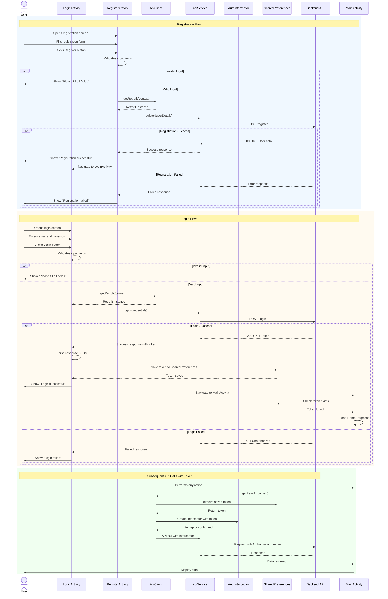
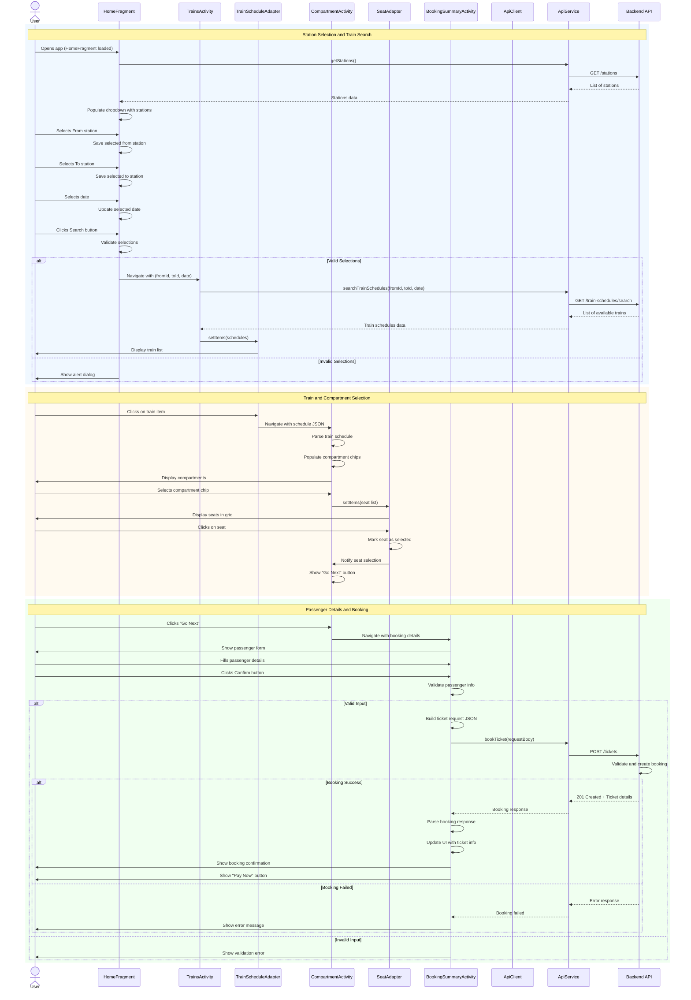
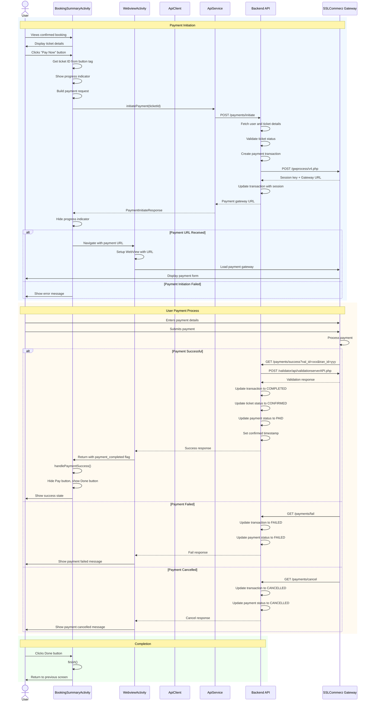
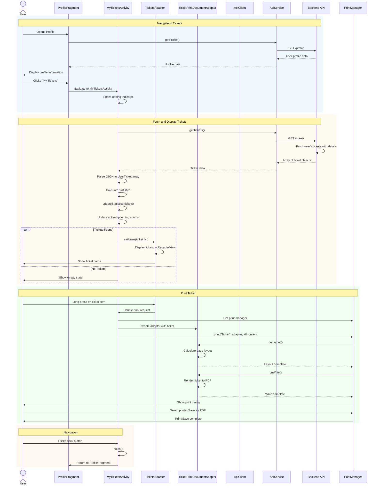
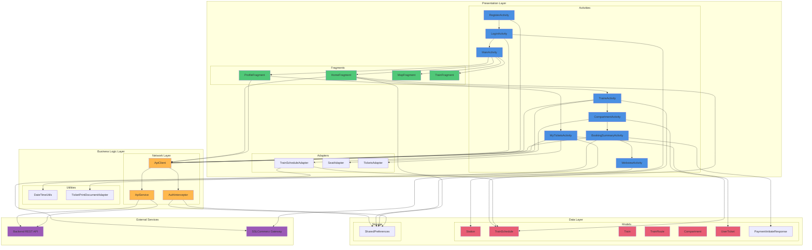

# RailNet Android Application - UML Design Documentation

This document contains comprehensive UML diagrams for the RailNet Android application, created using Mermaid syntax. These diagrams provide a complete overview of the application's architecture, class structure, and behavioral flows.

## Table of Contents
- [Class Diagram](#class-diagram)
- [Sequence Diagrams](#sequence-diagrams)
  - [User Authentication Flow](#user-authentication-flow)
  - [Train Search and Booking Flow](#train-search-and-booking-flow)
  - [Payment Processing Flow](#payment-processing-flow)
  - [My Tickets Viewing Flow](#my-tickets-viewing-flow)
- [Activity Diagrams](#activity-diagrams)
  - [Complete Ticket Booking Process](#complete-ticket-booking-process)
  - [User Login Process](#user-login-process)
  - [Train Search Process](#train-search-process)
  - [Profile Management Process](#profile-management-process)
- [Component Diagram](#component-diagram)
- [Package Diagram](#package-diagram)

---

## Class Diagram

This comprehensive class diagram shows all major classes in the Android application, their attributes, methods, and relationships following proper UML structure.

```mermaid
classDiagram
    %% Main Activity and Base Classes
    class MainActivity {
        -LinearLayout homeLayout
        -LinearLayout mapLayout
        -LinearLayout profileLayout
        -ImageView homeIcon, mapIcon, profileIcon
        -TextView homeText, mapText, profileText
        +onCreate(Bundle)
        +loadFragment(Fragment)
        -configureNavigation()
        -highLightNavigation(LinearLayout)
        -resetNavigation()
    }

    %% Authentication Activities
    class LoginActivity {
        -TextInputEditText emailEditText
        -TextInputEditText passwordEditText
        -LinearLayout loginButton
        -TextView registerLink
        -SharedPreferences sharedPreferences
        +onCreate(Bundle)
        -login(String, String)
    }

    class RegisterActivity {
        -TextInputEditText firstName
        -TextInputEditText lastName
        -TextInputEditText emailEditText
        -TextInputEditText phone
        -TextInputEditText address
        -TextInputEditText passwordEditText
        -LinearLayout registerButton
        -TextView loginLink
        +onCreate(Bundle)
        -register(String, String, String, String, String, String)
    }

    %% Fragment Classes
    class HomeFragment {
        -AutoCompleteTextView actvFrom
        -AutoCompleteTextView actvTo
        -TextView tvSelectedDate
        -Button btnSearchTrains
        -List~Station~ stations
        -Map~String,Station~ stationByName
        -Map~Integer,Station~ stationById
        -Station selectedFrom
        -Station selectedTo
        -Calendar selectedDate
        -SimpleDateFormat displayDateFormat
        -SimpleDateFormat apiDateFormat
        +onCreateView(LayoutInflater, ViewGroup, Bundle)
        -initializeViews(View)
        -setupEventListeners()
        -initializeDate()
        -fetchStations()
        -performSearch()
        -showDatePicker()
        -loadStationsFromPreferences()
        -saveStationToPreferences(String, String, Station)
    }

    class ProfileFragment {
        -ImageView ivCoverPhoto
        -ImageView ivProfileAvatar
        -FloatingActionButton fabEditCover
        -MaterialButton btnEditProfile
        -TextView tvUserName
        -TextView tvMemberDate
        -TextView tvUserEmail
        -TextView tvUserPhone
        -TextView tvUserLocation
        -LinearLayout btnMyTickets
        -LinearLayout btnSettings
        +onCreateView(LayoutInflater, ViewGroup, Bundle)
        +onViewCreated(View, Bundle)
        -initializeViews(View)
        -setupClickListeners()
        -loadUserData()
        -onMyTicketsClick()
    }

    class MapFragment {
        +onCreateView(LayoutInflater, ViewGroup, Bundle)
    }

    class TrainFragment {
        +onCreateView(LayoutInflater, ViewGroup, Bundle)
    }

    %% Activity Classes
    class TrainsActivity {
        -RecyclerView rvSchedules
        -TrainScheduleAdapter adapter
        -View progressContainer
        -View emptyContainer
        -TextView tvTrainCount
        +onCreate(Bundle)
        -fetchTrainSchedules(String, String, String)
    }

    class CompartmentActivity {
        -ChipGroup chipGroupCompartments
        -RecyclerView rvSeats
        -SeatAdapter seatAdapter
        -View btnNext
        -String[] selectedSeat
        -int[] selectedCompartmentId
        +onCreate(Bundle)
        -populateCompartments(TrainSchedule)
    }

    class BookingSummaryActivity {
        -EditText etName
        -EditText etAge
        -Spinner spinnerGender
        -Button btnConfirm
        -Button btnPay
        -Button btnDone
        -TextView tvTicketId
        -TextView tvTicketStatus
        -TextView tvPassengerName
        -View progressBooking
        -View cardResult
        +onCreate(Bundle)
        -bookTicket(String, int, String)
        -initiatePayment(String)
        -handlePaymentSuccess()
        -formatDisplayDate(String)
        -getStatusWithEmoji(String)
    }

    class MyTicketsActivity {
        -RecyclerView rv
        -TicketsAdapter adapter
        -View progress
        -TextView tvEmpty
        -TextView tvError
        -TextView tvActiveTickets
        -TextView tvUpcomingTrips
        -TextView tvTotalBookings
        -ImageView btnBack
        +onCreate(Bundle)
        -fetchTickets()
        -updateStatistics(List~UserTicket~)
        -showLoading(boolean)
        -showEmpty()
        -showError(String)
    }

    class WebviewActivity {
        -WebView webView
        -ProgressBar progressBar
        +onCreate(Bundle)
        -setupWebView(String)
    }

    %% Adapter Classes
    class TrainScheduleAdapter {
        -List~TrainSchedule~ items
        -OnItemClickListener listener
        +TrainScheduleAdapter(OnItemClickListener)
        +setItems(List~TrainSchedule~)
        +onCreateViewHolder(ViewGroup, int)
        +onBindViewHolder(ViewHolder, int)
        +getItemCount()
        -bindToHolder(ViewHolder, TrainSchedule)
        -formatTrainName(TrainSchedule)
        -formatTimesAndRoute(TrainSchedule)
        -formatPrice(TrainSchedule)
    }

    class SeatAdapter {
        -List~String~ items
        -String selectedSeat
        -OnSeatClickListener listener
        +SeatAdapter(List~String~, OnSeatClickListener)
        +setItems(List~String~)
        +setSelectedSeat(String)
        +onCreateViewHolder(ViewGroup, int)
        +onBindViewHolder(ViewHolder, int)
        +getItemCount()
    }

    class TicketsAdapter {
        -List~UserTicket~ items
        +setItems(List~UserTicket~)
        +onCreateViewHolder(ViewGroup, int)
        +onBindViewHolder(ViewHolder, int)
        +getItemCount()
        -formatDateTime(String)
        -getStatusColor(String)
    }

    %% Network Layer
    class ApiClient {
        -Retrofit secureRetrofit
        -String PREFS_NAME
        -String TOKEN_KEY
        +getRetrofit(Context) Retrofit
    }

    class ApiService {
        <<interface>>
        +login(Map~String,String~) Call~ResponseBody~
        +register(Map~String,String~) Call~ResponseBody~
        +getProfile() Call~ResponseBody~
        +getStations() Call~List~Station~~
        +searchTrainSchedules(String, String, String) Call~ResponseBody~
        +bookTicket(RequestBody) Call~ResponseBody~
        +getTickets() Call~ResponseBody~
        +initiatePayment(Map~String,String~) Call~PaymentInitiateResponse~
    }

    class AuthInterceptor {
        -Context context
        -String TOKEN_KEY
        +intercept(Chain) Response
    }

    %% Model Classes
    class Station {
        +int id
        +String name
        +String city
        +double latitude
        +double longitude
        +String createdAt
        +String updatedAt
    }

    class TrainSchedule {
        +int id
        +int trainId
        +int trainRouteId
        +Train train
        +TrainRoute trainRoute
        +String date
        +String time
        +List~StationTime~ stationTimes
        +String createdAt
        +String updatedAt
    }

    class Train {
        +int id
        +String name
        +String number
        +int trainRouteId
        +TrainRoute trainRoute
        +List~CompartmentAssignment~ compartments
    }

    class TrainRoute {
        +int id
        +String name
        +int startStationId
        +int endStationId
        +SimpleStation startStation
        +SimpleStation endStation
        +List~RouteStation~ routeStations
    }

    class Compartment {
        +int id
        +String name
        +String clazz
        +String type
        +double price
        +int totalSeats
    }

    class CompartmentAssignment {
        +int id
        +int trainId
        +int compartmentId
        +int quantity
        +Compartment compartment
    }

    class StationTime {
        +int id
        +int trainScheduleId
        +int stationId
        +SimpleStation station
        +String arrivalTime
        +String departureTime
        +int sequence
    }

    class UserTicket {
        +TicketInfo ticket
        +PassengerInfo passenger
        +JourneyInfo journey
        +SeatInfo seat
        +PricingInfo pricing
    }

    class PaymentInitiateResponse {
        +String paymentUrl
        +String transactionId
        +String sessionKey
    }

    %% Utility Classes
    class DateTimeUtils {
        +formatTimeFromIso(String) String
        +formatTimeForDisplay(String) String
        +formatDateForDisplay(String) String
    }

    class TicketPrintDocumentAdapter {
        -Context context
        -UserTicket ticket
        +TicketPrintDocumentAdapter(Context, UserTicket)
        +onLayout(PrintAttributes, PrintAttributes, CancellationSignal, LayoutResultCallback, Bundle)
        +onWrite(PageRange[], ParcelFileDescriptor, CancellationSignal, WriteResultCallback)
    }

    %% Relationships
    MainActivity --> HomeFragment : manages
    MainActivity --> MapFragment : manages
    MainActivity --> ProfileFragment : manages
    MainActivity --> TrainFragment : manages

    LoginActivity --> ApiClient : uses
    LoginActivity --> ApiService : uses
    RegisterActivity --> ApiClient : uses
    RegisterActivity --> ApiService : uses

    HomeFragment --> Station : uses
    HomeFragment --> ApiClient : uses
    HomeFragment --> ApiService : uses
    HomeFragment --> TrainsActivity : navigates to

    TrainsActivity --> TrainScheduleAdapter : uses
    TrainsActivity --> TrainSchedule : handles
    TrainsActivity --> ApiClient : uses
    TrainsActivity --> ApiService : uses
    TrainsActivity --> CompartmentActivity : navigates to

    CompartmentActivity --> SeatAdapter : uses
    CompartmentActivity --> TrainSchedule : uses
    CompartmentActivity --> BookingSummaryActivity : navigates to

    BookingSummaryActivity --> ApiClient : uses
    BookingSummaryActivity --> ApiService : uses
    BookingSummaryActivity --> WebviewActivity : navigates to

    ProfileFragment --> MyTicketsActivity : navigates to
    ProfileFragment --> ApiClient : uses
    ProfileFragment --> ApiService : uses

    MyTicketsActivity --> TicketsAdapter : uses
    MyTicketsActivity --> UserTicket : handles
    MyTicketsActivity --> ApiClient : uses
    MyTicketsActivity --> ApiService : uses
    MyTicketsActivity --> TicketPrintDocumentAdapter : uses

    TrainScheduleAdapter --> TrainSchedule : displays
    TrainScheduleAdapter --> DateTimeUtils : uses
    SeatAdapter --> String : displays
    TicketsAdapter --> UserTicket : displays

    ApiClient --> AuthInterceptor : uses
    ApiClient ..> ApiService : creates

    TrainSchedule --> Train : contains
    TrainSchedule --> TrainRoute : contains
    TrainSchedule --> StationTime : contains
    Train --> CompartmentAssignment : contains
    TrainRoute --> Station : references
    CompartmentAssignment --> Compartment : contains
    StationTime --> Station : references

    %% Interface implementations
    TrainScheduleAdapter ..|> "RecyclerView.Adapter" : implements
    SeatAdapter ..|> "RecyclerView.Adapter" : implements
    TicketsAdapter ..|> "RecyclerView.Adapter" : implements

    %% Inner classes
    TrainScheduleAdapter +-- ViewHolder
    TrainScheduleAdapter +-- OnItemClickListener
    SeatAdapter +-- ViewHolder
    SeatAdapter +-- OnSeatClickListener
    TicketsAdapter +-- ViewHolder

    BookingSummaryActivity +-- TicketRequest
    BookingSummaryActivity +-- BookingResponse
    BookingSummaryActivity +-- Ticket
    BookingSummaryActivity +-- Passenger
```

---

## Sequence Diagrams

### User Authentication Flow

This sequence diagram illustrates the complete user authentication process including both login and registration.



---

### Train Search and Booking Flow

This sequence diagram shows the complete flow from searching trains to booking a ticket.



---

### Payment Processing Flow

This sequence diagram illustrates the payment initiation and processing workflow.



---

### My Tickets Viewing Flow

This sequence diagram shows how users view their booked tickets.



---

## Activity Diagrams

### Complete Ticket Booking Process

This activity diagram shows the end-to-end ticket booking flow with all decision points and actions.

```mermaid
flowchart TD
    Start([User Opens App]) --> CheckAuth{Authenticated?}
    CheckAuth -->|No| ShowLogin[Show LoginActivity]
    ShowLogin --> DoLogin[User Logs In]
    DoLogin --> SaveToken[Save JWT Token]
    SaveToken --> LoadHome[Load MainActivity with HomeFragment]
    CheckAuth -->|Yes| LoadHome
    
    LoadHome --> FetchStations[Fetch Stations from API]
    FetchStations --> PopulateDropdowns[Populate From/To Dropdowns]
    PopulateDropdowns --> WaitInput[Wait for User Input]
    
    WaitInput --> SelectFrom[User Selects From Station]
    SelectFrom --> SelectTo[User Selects To Station]
    SelectTo --> SelectDate[User Selects Date]
    SelectDate --> ClickSearch[User Clicks Search]
    
    ClickSearch --> ValidateInput{Validate Input?}
    ValidateInput -->|Invalid| ShowError1[Show Validation Error]
    ShowError1 --> WaitInput
    ValidateInput -->|Valid| CheckSameStation{From != To?}
    
    CheckSameStation -->|Same| ShowError2[Show "Stations Must be Different"]
    ShowError2 --> WaitInput
    CheckSameStation -->|Different| SearchTrains[Call searchTrainSchedules API]
    
    SearchTrains --> ProcessResponse{Response OK?}
    ProcessResponse -->|Error| ShowNetworkError[Show Network Error]
    ShowNetworkError --> WaitInput
    ProcessResponse -->|Success| ParseSchedules[Parse Train Schedules]
    
    ParseSchedules --> HasTrains{Trains Available?}
    HasTrains -->|No| ShowEmptyState[Show "No Trains Found"]
    ShowEmptyState --> WaitInput
    HasTrains -->|Yes| DisplayTrains[Display Train List]
    
    DisplayTrains --> WaitSelection[Wait for Train Selection]
    WaitSelection --> UserSelectsTrain[User Clicks Train]
    UserSelectsTrain --> NavigateCompartment[Navigate to CompartmentActivity]
    
    NavigateCompartment --> ShowCompartments[Show Compartment Chips]
    ShowCompartments --> WaitCompartment[Wait for Compartment Selection]
    WaitCompartment --> SelectCompartment[User Selects Compartment]
    SelectCompartment --> LoadSeats[Load Available Seats]
    LoadSeats --> DisplaySeats[Display Seat Grid]
    
    DisplaySeats --> WaitSeat[Wait for Seat Selection]
    WaitSeat --> SelectSeat[User Selects Seat]
    SelectSeat --> ShowNextButton[Show "Go Next" Button]
    ShowNextButton --> ClickNext[User Clicks Next]
    
    ClickNext --> NavigateBooking[Navigate to BookingSummaryActivity]
    NavigateBooking --> ShowPassengerForm[Show Passenger Details Form]
    ShowPassengerForm --> WaitPassenger[Wait for Input]
    WaitPassenger --> FillDetails[User Fills Details]
    FillDetails --> ClickConfirm[User Clicks Confirm]
    
    ClickConfirm --> ValidatePassenger{Valid Details?}
    ValidatePassenger -->|Invalid| ShowPassengerError[Show Validation Error]
    ShowPassengerError --> WaitPassenger
    ValidatePassenger -->|Valid| BuildRequest[Build Booking Request]
    
    BuildRequest --> CallBookAPI[Call bookTicket API]
    CallBookAPI --> BookingResponse{Booking Success?}
    BookingResponse -->|Failed| ShowBookingError[Show Booking Error]
    ShowBookingError --> End1([Booking Failed])
    BookingResponse -->|Success| ParseBooking[Parse Booking Response]
    
    ParseBooking --> DisplayTicket[Display Ticket Details]
    DisplayTicket --> ShowPayButton[Show "Pay Now" Button]
    ShowPayButton --> WaitPayment[Wait for Payment]
    WaitPayment --> ClickPay[User Clicks Pay]
    
    ClickPay --> InitiatePayment[Call initiatePayment API]
    InitiatePayment --> PaymentInit{Init Success?}
    PaymentInit -->|Failed| ShowPaymentError[Show Payment Error]
    ShowPaymentError --> End2([Payment Failed])
    PaymentInit -->|Success| GetGatewayURL[Get Payment Gateway URL]
    
    GetGatewayURL --> OpenWebView[Open WebviewActivity]
    OpenWebView --> LoadGateway[Load SSLCommerz Gateway]
    LoadGateway --> UserPays[User Enters Payment Details]
    UserPays --> SubmitPayment[Submit Payment]
    
    SubmitPayment --> ProcessPayment{Payment Result?}
    ProcessPayment -->|Cancelled| PaymentCancelled[Update Status: Cancelled]
    ProcessPayment -->|Failed| PaymentFailed[Update Status: Failed]
    ProcessPayment -->|Success| ValidatePayment[Validate with Gateway]
    
    ValidatePayment --> UpdateTicket[Update Ticket: Confirmed]
    UpdateTicket --> UpdatePaymentStatus[Update Payment: Paid]
    UpdatePaymentStatus --> ShowSuccess[Show Success State]
    ShowSuccess --> ClickDone[User Clicks Done]
    
    ClickDone --> End3([Booking Complete])
    PaymentCancelled --> End4([Payment Cancelled])
    PaymentFailed --> End5([Payment Failed])
    
    style Start fill:#90EE90
    style End1 fill:#FFB6C1
    style End2 fill:#FFB6C1
    style End3 fill:#98FB98
    style End4 fill:#FFA500
    style End5 fill:#FFB6C1
    style ShowError1 fill:#FFE4B5
    style ShowError2 fill:#FFE4B5
    style ShowNetworkError fill:#FFE4B5
    style ShowPassengerError fill:#FFE4B5
    style ShowBookingError fill:#FFE4B5
    style ShowPaymentError fill:#FFE4B5
    style ValidatePayment fill:#87CEEB
    style CallBookAPI fill:#87CEEB
    style InitiatePayment fill:#87CEEB
```

---

### User Login Process

This activity diagram shows the detailed login process with error handling.

```mermaid
flowchart TD
    Start([User Opens App]) --> CheckToken{Token Exists?}
    CheckToken -->|Yes| ValidateToken{Token Valid?}
    ValidateToken -->|Yes| LoadMain[Load MainActivity]
    ValidateToken -->|No| ClearToken[Clear Invalid Token]
    ClearToken --> ShowLogin
    CheckToken -->|No| ShowLogin[Show LoginActivity]
    
    ShowLogin --> DisplayForm[Display Login Form]
    DisplayForm --> WaitInput[Wait for User Input]
    WaitInput --> EnterEmail[User Enters Email]
    EnterEmail --> EnterPassword[User Enters Password]
    EnterPassword --> ClickLogin[User Clicks Login]
    
    ClickLogin --> ValidateInput{Input Valid?}
    ValidateInput -->|Empty Fields| ShowError1[Show "Please fill all fields"]
    ShowError1 --> WaitInput
    ValidateInput -->|Valid| BuildCredentials[Build Credentials Map]
    
    BuildCredentials --> GetRetrofit[Get Retrofit Instance]
    GetRetrofit --> CreateService[Create ApiService]
    CreateService --> CallLoginAPI[Call login API]
    
    CallLoginAPI --> ShowProgress[Show Loading]
    ShowProgress --> WaitResponse[Wait for Response]
    WaitResponse --> CheckResponse{Response OK?}
    
    CheckResponse -->|Network Error| HideProgress1[Hide Loading]
    HideProgress1 --> ShowNetworkError[Show "Network error"]
    ShowNetworkError --> WaitInput
    
    CheckResponse -->|Failed 401| HideProgress2[Hide Loading]
    HideProgress2 --> ShowLoginFailed[Show "Login failed"]
    ShowLoginFailed --> WaitInput
    
    CheckResponse -->|Success 200| HideProgress3[Hide Loading]
    HideProgress3 --> ParseResponse[Parse JSON Response]
    ParseResponse --> ParseSuccess{Parse OK?}
    
    ParseSuccess -->|Failed| ShowParseError[Show "Failed to parse response"]
    ShowParseError --> WaitInput
    ParseSuccess -->|Success| ExtractToken[Extract JWT Token]
    
    ExtractToken --> GetSharedPrefs[Get SharedPreferences]
    GetSharedPrefs --> SaveToken[Save Token to Preferences]
    SaveToken --> CommitPrefs[Commit Changes]
    CommitPrefs --> ShowSuccess[Show Success Message]
    ShowSuccess --> NavigateMain[Navigate to MainActivity]
    
    NavigateMain --> FinishLogin[Finish LoginActivity]
    FinishLogin --> LoadMain
    LoadMain --> CheckMainToken{Token Exists?}
    CheckMainToken -->|No| BackToLogin[Return to LoginActivity]
    CheckMainToken -->|Yes| LoadHomeFragment[Load HomeFragment]
    LoadHomeFragment --> End([User Logged In])
    
    BackToLogin --> ShowLogin
    
    style Start fill:#90EE90
    style End fill:#98FB98
    style ShowError1 fill:#FFB6C1
    style ShowNetworkError fill:#FFB6C1
    style ShowLoginFailed fill:#FFB6C1
    style ShowParseError fill:#FFB6C1
    style CallLoginAPI fill:#87CEEB
    style SaveToken fill:#87CEEB
    style ShowProgress fill:#E6E6FA
```

---

### Train Search Process

This activity diagram illustrates the train search functionality flow.

```mermaid
flowchart TD
    Start([HomeFragment Loaded]) --> FetchStations[Fetch Stations from API]
    FetchStations --> ShowProgress1[Show Loading]
    ShowProgress1 --> CallStationsAPI[Call getStations API]
    
    CallStationsAPI --> StationsResponse{Response OK?}
    StationsResponse -->|Error| HideProgress1[Hide Loading]
    HideProgress1 --> LogError[Log Error]
    LogError --> ShowEmptyDropdowns[Show Empty Dropdowns]
    StationsResponse -->|Success| HideProgress2[Hide Loading]
    
    HideProgress2 --> ParseStations[Parse Station List]
    ParseStations --> BuildMaps[Build stationByName & stationById Maps]
    BuildMaps --> ExtractNames[Extract Station Names]
    ExtractNames --> CreateAdapter[Create ArrayAdapter]
    CreateAdapter --> SetAdapters[Set Adapters to AutoCompleteTextViews]
    SetAdapters --> RestoreSelections[Restore Previous Selections from Prefs]
    
    RestoreSelections --> WaitUserAction[Wait for User Action]
    
    WaitUserAction --> UserAction{User Action?}
    UserAction -->|Clicks From Layout| ShowFromDropdown[Show From Dropdown]
    ShowFromDropdown --> WaitFromSelect[Wait for Selection]
    WaitFromSelect --> SelectFromStation[User Selects From Station]
    SelectFromStation --> SaveFromPrefs[Save From to SharedPreferences]
    SaveFromPrefs --> UpdateFromUI[Update From UI]
    UpdateFromUI --> WaitUserAction
    
    UserAction -->|Clicks To Layout| ShowToDropdown[Show To Dropdown]
    ShowToDropdown --> WaitToSelect[Wait for Selection]
    WaitToSelect --> SelectToStation[User Selects To Station]
    SelectToStation --> SaveToPrefs[Save To to SharedPreferences]
    SaveToPrefs --> UpdateToUI[Update To UI]
    UpdateToUI --> WaitUserAction
    
    UserAction -->|Clicks Date Layout| ShowDatePicker[Show DatePickerDialog]
    ShowDatePicker --> SetMinDate[Set Min Date to Today]
    SetMinDate --> WaitDateSelect[Wait for Selection]
    WaitDateSelect --> SelectDate[User Selects Date]
    SelectDate --> UpdateDateCalendar[Update selectedDate Calendar]
    UpdateDateCalendar --> FormatDate[Format Date for Display]
    FormatDate --> UpdateDateUI[Update Date TextView]
    UpdateDateUI --> WaitUserAction
    
    UserAction -->|Clicks Search Button| StartValidation[Start Validation]
    StartValidation --> LoadFromPrefs{Load Stations from Prefs?}
    LoadFromPrefs -->|Not Selected| TryLoadPrefs[Load from SharedPreferences]
    TryLoadPrefs --> LoadFromPrefs
    LoadFromPrefs -->|Loaded| CheckStations{Both Stations Selected?}
    
    CheckStations -->|No| ShowAlert1[Show "Please select both stations"]
    ShowAlert1 --> WaitUserAction
    CheckStations -->|Yes| CompareStat{From != To?}
    
    CompareStat -->|Same| ShowAlert2[Show "Stations must be different"]
    ShowAlert2 --> WaitUserAction
    CompareStat -->|Different| PrepareSearch[Prepare Search Parameters]
    
    PrepareSearch --> FormatAPIDate[Format Date to yyyy-MM-dd]
    FormatAPIDate --> ConvertIds[Convert Station IDs to String]
    ConvertIds --> CreateIntent[Create Intent to TrainsActivity]
    CreateIntent --> PutExtras[Put fromId, toId, date, names]
    PutExtras --> StartActivity[Start TrainsActivity]
    
    StartActivity --> TrainsOnCreate[TrainsActivity onCreate]
    TrainsOnCreate --> ReadExtras[Read Intent Extras]
    ReadExtras --> ValidateExtras{Extras Valid?}
    ValidateExtras -->|Invalid| FinishActivity[Finish Activity]
    ValidateExtras -->|Valid| ShowProgressTrains[Show Progress Container]
    
    ShowProgressTrains --> HideRecycler[Hide RecyclerView]
    HideRecycler --> CallSearchAPI[Call searchTrainSchedules API]
    CallSearchAPI --> SearchResponse{Response OK?}
    
    SearchResponse -->|Network Error| HideProgressError[Hide Progress]
    HideProgressError --> ShowEmptyState[Show Empty State]
    ShowEmptyState --> SetCountZero[Set "0 Trains"]
    SetCountZero --> End1([Search Failed])
    
    SearchResponse -->|Failed| HideProgressFailed[Hide Progress]
    HideProgressFailed --> LogFailure[Log Response Code]
    LogFailure --> ShowEmptyState
    
    SearchResponse -->|Success| HideProgressSuccess[Hide Progress]
    HideProgressSuccess --> ReadBody[Read Response Body]
    ReadBody --> ParseJSON[Parse JSON]
    ParseJSON --> CheckArray{Array or Object?}
    
    CheckArray -->|Array| UseArray[Use as JsonArray]
    CheckArray -->|Object with data| ExtractData[Extract "data" array]
    ExtractData --> UseArray
    UseArray --> CheckSize{Array Size > 0?}
    
    CheckSize -->|Empty| ShowNoTrains[Show "No Trains Found"]
    ShowNoTrains --> End2([No Results])
    CheckSize -->|Has Items| ConvertToList[Convert to List<TrainSchedule>]
    
    ConvertToList --> ShowRecycler[Show RecyclerView]
    ShowRecycler --> HideEmpty[Hide Empty State]
    HideEmpty --> SetCount[Set Train Count]
    SetCount --> UpdateAdapter[adapter.setItems schedules]
    UpdateAdapter --> DisplayTrains[Display Train Cards]
    DisplayTrains --> End3([Search Complete])
    
    style Start fill:#90EE90
    style End1 fill:#FFB6C1
    style End2 fill:#FFA500
    style End3 fill:#98FB98
    style ShowAlert1 fill:#FFE4B5
    style ShowAlert2 fill:#FFE4B5
    style CallStationsAPI fill:#87CEEB
    style CallSearchAPI fill:#87CEEB
    style ShowProgress1 fill:#E6E6FA
    style ShowProgressTrains fill:#E6E6FA
```

---

### Profile Management Process

This activity diagram shows the profile viewing and navigation flow.

```mermaid
flowchart TD
    Start([User Opens Profile]) --> LoadProfileFrag[Load ProfileFragment]
    LoadProfileFrag --> InitViews[Initialize Views]
    InitViews --> SetupListeners[Setup Click Listeners]
    SetupListeners --> CallProfileAPI[Call getProfile API]
    
    CallProfileAPI --> ShowProgress[Show Loading]
    ShowProgress --> WaitResponse[Wait for Response]
    WaitResponse --> CheckResponse{Response OK?}
    
    CheckResponse -->|Network Error| HideProgress1[Hide Loading]
    HideProgress1 --> ShowErrorToast[Show "Error loading user data"]
    ShowErrorToast --> LogError[Log Error Details]
    LogError --> ShowDefaultUI[Show Default Profile UI]
    ShowDefaultUI --> WaitAction[Wait for User Action]
    
    CheckResponse -->|Failed| HideProgress2[Hide Loading]
    HideProgress2 --> ShowFailToast[Show "Failed to load user data"]
    ShowFailToast --> LogResponse[Log Response Code]
    LogResponse --> ShowDefaultUI
    
    CheckResponse -->|Success| HideProgress3[Hide Loading]
    HideProgress3 --> ReadBody[Read Response Body]
    ReadBody --> ParseJSON[Parse JSON]
    ParseJSON --> ParseSuccess{Parse OK?}
    
    ParseSuccess -->|Failed| ShowParseError[Show Parse Error]
    ShowParseError --> ShowDefaultUI
    ParseSuccess -->|Success| ExtractFields[Extract User Fields]
    
    ExtractFields --> GetFirstName[Get firstName]
    GetFirstName --> GetLastName[Get lastName]
    GetLastName --> GetEmail[Get email]
    GetEmail --> GetPhone[Get phone]
    GetPhone --> GetAddress[Get address]
    GetAddress --> GetCreatedAt[Get createdAt]
    
    GetCreatedAt --> UpdateName[Update tvUserName]
    UpdateName --> UpdateEmail[Update tvUserEmail]
    UpdateEmail --> UpdatePhone[Update tvUserPhone]
    UpdatePhone --> UpdateLocation[Update tvUserLocation]
    UpdateLocation --> UpdateMemberDate[Update tvMemberDate]
    UpdateMemberDate --> DisplayProfile[Display Complete Profile]
    
    DisplayProfile --> WaitAction
    
    WaitAction --> UserAction{User Action?}
    
    UserAction -->|Clicks Cover Photo| ShowCoverToast[Show "View cover photo"]
    ShowCoverToast --> WaitAction
    
    UserAction -->|Clicks Edit Cover FAB| ShowEditCoverToast[Show "Change cover photo"]
    ShowEditCoverToast --> WaitAction
    
    UserAction -->|Clicks Profile Avatar| ShowAvatarToast[Show "Change profile photo"]
    ShowAvatarToast --> WaitAction
    
    UserAction -->|Clicks Edit Profile| ShowEditToast[Show "Edit Profile"]
    ShowEditToast --> WaitAction
    
    UserAction -->|Clicks My Tickets| NavigateTickets[Navigate to MyTicketsActivity]
    NavigateTickets --> LoadMyTickets[Load MyTicketsActivity]
    LoadMyTickets --> ShowTicketProgress[Show Progress]
    ShowTicketProgress --> CallTicketsAPI[Call getTickets API]
    
    CallTicketsAPI --> TicketsResponse{Response OK?}
    TicketsResponse -->|Error| HideTicketProgress1[Hide Progress]
    HideTicketProgress1 --> ShowNetworkError[Show "Network error"]
    ShowNetworkError --> End1([Tickets Load Failed])
    
    TicketsResponse -->|Failed| HideTicketProgress2[Hide Progress]
    HideTicketProgress2 --> ShowErrorMessage[Show Error Message]
    ShowErrorMessage --> End1
    
    TicketsResponse -->|Success| HideTicketProgress3[Hide Progress]
    HideTicketProgress3 --> ParseTickets[Parse Ticket Array]
    ParseTickets --> ConvertToList[Convert to List<UserTicket>]
    ConvertToList --> CalcStats[Calculate Statistics]
    
    CalcStats --> CountActive[Count Active Tickets]
    CountActive --> CountUpcoming[Count Upcoming Trips]
    CountUpcoming --> CountTotal[Count Total Bookings]
    CountTotal --> UpdateStatsUI[Update Statistics TextViews]
    
    UpdateStatsUI --> CheckEmpty{Tickets Empty?}
    CheckEmpty -->|Yes| ShowEmptyView[Show Empty State]
    ShowEmptyView --> End2([No Tickets])
    CheckEmpty -->|No| UpdateAdapter[adapter.setItems tickets]
    
    UpdateAdapter --> DisplayTicketList[Display Ticket Cards]
    DisplayTicketList --> WaitTicketAction[Wait for Action]
    WaitTicketAction --> BackPressed[User Clicks Back]
    BackPressed --> ReturnProfile[Return to ProfileFragment]
    ReturnProfile --> WaitAction
    
    UserAction -->|Clicks Settings| ShowSettingsToast[Show "Settings clicked"]
    ShowSettingsToast --> WaitAction
    
    UserAction -->|Navigates Away| End3([Profile Session End])
    
    style Start fill:#90EE90
    style End1 fill:#FFB6C1
    style End2 fill:#FFA500
    style End3 fill:#98FB98
    style ShowErrorToast fill:#FFE4B5
    style ShowFailToast fill:#FFE4B5
    style ShowNetworkError fill:#FFE4B5
    style CallProfileAPI fill:#87CEEB
    style CallTicketsAPI fill:#87CEEB
    style ShowProgress fill:#E6E6FA
    style ShowTicketProgress fill:#E6E6FA
```

---

## Component Diagram

This diagram shows the high-level component structure of the Android application.



---

## Package Diagram

This diagram shows the package organization and dependencies in the Android application.

```mermaid
graph TB
    subgraph "com.mojahid2021.railnet"
        MainActivity
        
        subgraph "auth"
            LoginActivity
            RegisterActivity
        end
        
        subgraph "home"
            HomeFragment
            TrainScheduleAdapter
            SeatAdapter
            
            subgraph "home.model"
                Station
                TrainSchedule
            end
        end
        
        subgraph "activity"
            TrainsActivity
            CompartmentActivity
            BookingSummaryActivity
            WebviewActivity
            
            subgraph "activity.myTickets"
                MyTicketsActivity
                TicketsAdapter
                UserTicket
                TicketPrintDocumentAdapter
            end
        end
        
        subgraph "profile"
            ProfileFragment
        end
        
        subgraph "map"
            MapFragment
        end
        
        subgraph "train"
            TrainFragment
        end
        
        subgraph "network"
            ApiClient
            ApiService
            AuthInterceptor
            PaymentInitiateResponse
        end
        
        subgraph "util"
            DateTimeUtils
        end
    end
    
    subgraph "External Dependencies"
        subgraph "androidx"
            AppCompatActivity
            Fragment
            RecyclerView
        end
        
        subgraph "retrofit2"
            Retrofit
            Call
        end
        
        subgraph "okhttp3"
            OkHttpClient
            Interceptor
        end
        
        subgraph "gson"
            Gson
        end
    end
    
    %% Dependencies
    MainActivity --> HomeFragment
    MainActivity --> ProfileFragment
    MainActivity --> MapFragment
    MainActivity --> TrainFragment
    MainActivity -.-> AppCompatActivity
    
    LoginActivity --> ApiClient
    LoginActivity --> ApiService
    LoginActivity -.-> AppCompatActivity
    RegisterActivity --> ApiClient
    RegisterActivity --> ApiService
    RegisterActivity -.-> AppCompatActivity
    
    HomeFragment --> Station
    HomeFragment --> ApiClient
    HomeFragment --> ApiService
    HomeFragment --> TrainsActivity
    HomeFragment -.-> Fragment
    
    TrainsActivity --> TrainScheduleAdapter
    TrainsActivity --> TrainSchedule
    TrainsActivity --> ApiClient
    TrainsActivity --> ApiService
    TrainsActivity --> CompartmentActivity
    TrainsActivity -.-> AppCompatActivity
    
    CompartmentActivity --> SeatAdapter
    CompartmentActivity --> TrainSchedule
    CompartmentActivity --> BookingSummaryActivity
    CompartmentActivity -.-> AppCompatActivity
    
    BookingSummaryActivity --> ApiClient
    BookingSummaryActivity --> ApiService
    BookingSummaryActivity --> PaymentInitiateResponse
    BookingSummaryActivity --> WebviewActivity
    BookingSummaryActivity -.-> AppCompatActivity
    
    ProfileFragment --> MyTicketsActivity
    ProfileFragment --> ApiClient
    ProfileFragment --> ApiService
    ProfileFragment -.-> Fragment
    
    MyTicketsActivity --> TicketsAdapter
    MyTicketsActivity --> UserTicket
    MyTicketsActivity --> ApiClient
    MyTicketsActivity --> ApiService
    MyTicketsActivity --> TicketPrintDocumentAdapter
    MyTicketsActivity -.-> AppCompatActivity
    
    TrainScheduleAdapter --> TrainSchedule
    TrainScheduleAdapter --> DateTimeUtils
    TrainScheduleAdapter -.-> RecyclerView
    
    TicketsAdapter --> UserTicket
    TicketsAdapter -.-> RecyclerView
    
    SeatAdapter -.-> RecyclerView
    
    ApiClient --> ApiService
    ApiClient --> AuthInterceptor
    ApiClient -.-> Retrofit
    ApiClient -.-> OkHttpClient
    
    ApiService -.-> Call
    
    AuthInterceptor -.-> Interceptor
    
    TrainSchedule --> Station
    
    style MainActivity fill:#4A90E2
    style LoginActivity fill:#4A90E2
    style RegisterActivity fill:#4A90E2
    style TrainsActivity fill:#4A90E2
    style CompartmentActivity fill:#4A90E2
    style BookingSummaryActivity fill:#4A90E2
    style MyTicketsActivity fill:#4A90E2
    
    style HomeFragment fill:#50C878
    style ProfileFragment fill:#50C878
    style MapFragment fill:#50C878
    style TrainFragment fill:#50C878
    
    style ApiClient fill:#FFB84D
    style ApiService fill:#FFB84D
    style AuthInterceptor fill:#FFB84D
    
    style Station fill:#E85D75
    style TrainSchedule fill:#E85D75
    style UserTicket fill:#E85D75
```



---

## Notes

### About These Diagrams

- **Mermaid Syntax**: All diagrams use Mermaid syntax for easy rendering in GitHub, GitLab, and other markdown-compatible platforms
- **UML Compliance**: Diagrams follow proper UML structure with correct notation for classes, relationships, and multiplicities
- **Comprehensive Coverage**: Includes all major components of the Android application
- **Color Coding**: Consistent color scheme to distinguish component types
  - Activities: Blue (#4A90E2)
  - Fragments: Green (#50C878)
  - Network Layer: Orange (#FFB84D)
  - Models: Pink (#E85D75)
  - External Services: Purple (#9B59B6)
  - Success States: Light Green (#98FB98)
  - Error States: Light Red (#FFB6C1)
  - Warning States: Orange (#FFA500)
  - Processing States: Light Purple (#E6E6FA)
  - API Calls: Sky Blue (#87CEEB)

### How to View These Diagrams

1. **GitHub/GitLab**: Diagrams render automatically in markdown preview
2. **VS Code**: Install "Markdown Preview Mermaid Support" extension
3. **Online Editor**: Visit https://mermaid.live/ for interactive editing
4. **Documentation Sites**: Most modern documentation platforms support Mermaid

### Diagram Maintenance Guidelines

When updating the Android codebase:

1. **Class Diagram**: 
   - Add new activities, fragments, or classes
   - Update method signatures when APIs change
   - Maintain relationship lines for dependencies

2. **Sequence Diagrams**: 
   - Update flows when business logic changes
   - Add new interactions when features are added
   - Ensure error paths are documented

3. **Activity Diagrams**: 
   - Reflect new user flows
   - Update decision points when validation changes
   - Document new navigation paths

4. **Component Diagram**: 
   - Add new modules or packages
   - Update dependencies when architecture changes

5. **Package Diagram**: 
   - Reflect package restructuring
   - Update dependencies between packages

### Architecture Patterns Used

- **MVP (Model-View-Presenter)**: Light MVP pattern with Activities/Fragments as views
- **Repository Pattern**: ApiClient and ApiService act as data repository
- **Adapter Pattern**: RecyclerView adapters for list display
- **Singleton Pattern**: ApiClient uses singleton for Retrofit instance
- **Observer Pattern**: LiveData and callbacks for async operations
- **Interceptor Pattern**: AuthInterceptor for request modification

### Key Design Decisions

1. **Token Management**: JWT tokens stored in SharedPreferences for session management
2. **API Communication**: Retrofit for type-safe HTTP client with Gson converter
3. **Async Operations**: Callbacks for API calls with proper error handling
4. **UI State Management**: View visibility manipulation for loading/error/success states
5. **Navigation**: Intent-based navigation with data passing via extras
6. **Adapter Pattern**: RecyclerView with ViewHolder pattern for efficient list rendering
7. **Separation of Concerns**: Clear separation between UI, business logic, and data layers

### Security Considerations

- Tokens stored securely in SharedPreferences
- HTTPS enforced through Retrofit configuration
- Authorization header added via interceptor
- Payment processing through external gateway (SSLCommerz)
- Input validation on both client and server side

---

## Additional Resources

- [Android Architecture Components](https://developer.android.com/topic/architecture)
- [Retrofit Documentation](https://square.github.io/retrofit/)
- [Mermaid Documentation](https://mermaid.js.org/)
- [UML Specification](https://www.omg.org/spec/UML/)

---

**Document Version**: 1.0  
**Last Updated**: 2025-12-10  
**Maintained By**: RailNet Development Team
