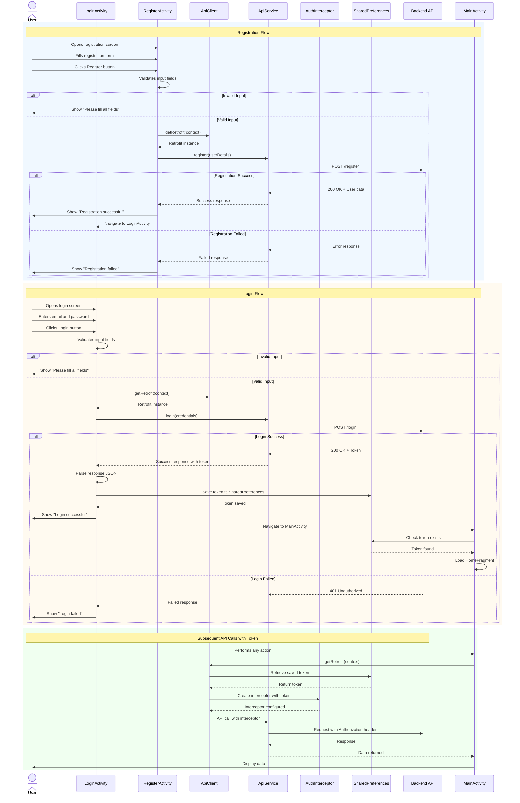
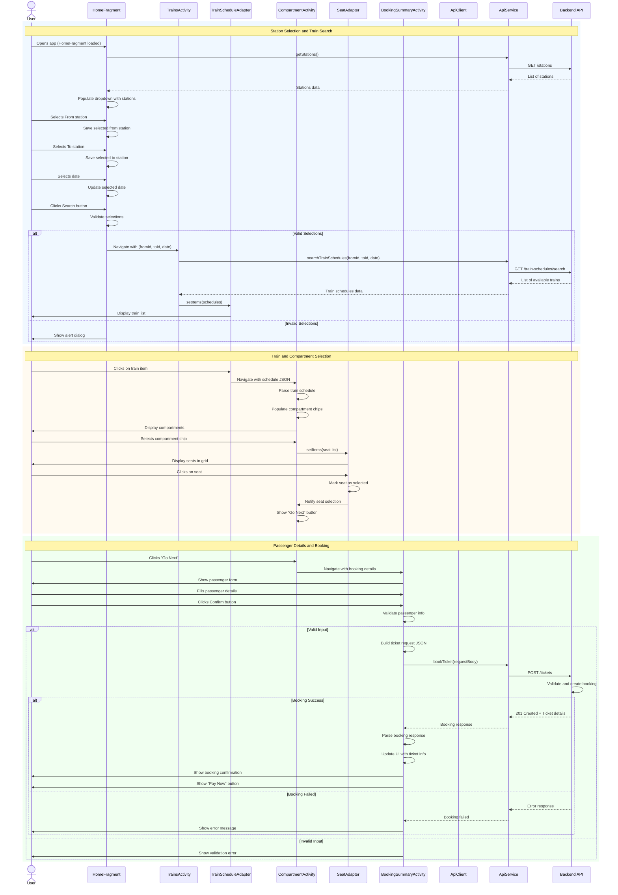
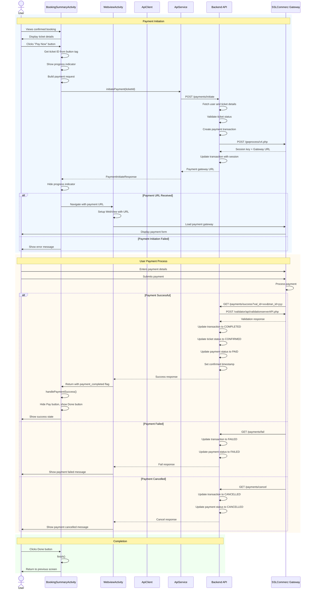
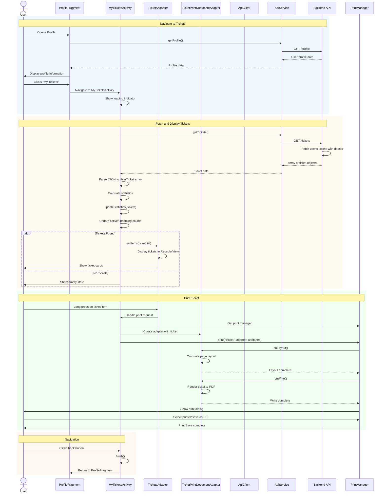
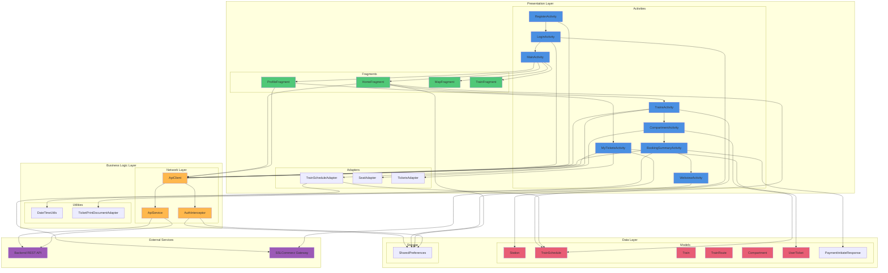

# RailNet Android Application - UML Design Documentation

This document contains comprehensive UML diagrams for the RailNet Android application, created using Mermaid syntax. These diagrams provide a complete overview of the application's architecture, class structure, and behavioral flows.

## Table of Contents
- [Class Diagram](#class-diagram)
- [Sequence Diagrams](#sequence-diagrams)
  - [User Authentication Flow](#user-authentication-flow)
  - [Train Search and Booking Flow](#train-search-and-booking-flow)
  - [Payment Processing Flow](#payment-processing-flow)
  - [My Tickets Viewing Flow](#my-tickets-viewing-flow)
- [Activity Diagrams](#activity-diagrams)
  - [Complete Ticket Booking Process](#complete-ticket-booking-process)
  - [User Login Process](#user-login-process)
  - [Train Search Process](#train-search-process)
  - [Profile Management Process](#profile-management-process)
- [Component Diagram](#component-diagram)
- [Package Diagram](#package-diagram)

---

## Class Diagram

This comprehensive class diagram shows all major classes in the Android application, their attributes, methods, and relationships following proper UML structure.

```mermaid
classDiagram
    %% Models
    class Station {
        +id : int
        +name : String
        +city : String
        +latitude : double
        +longitude : double
        +createdAt : String
        +updatedAt : String
    }

    class Train {
        +id : int
        +name : String
        +number : String
        +trainRouteId : int
        +trainRoute : TrainRoute
        +compartments : List_CompartmentAssignment
    }

    class TrainSchedule {
        +id : int
        +trainId : int
        +trainRouteId : int
        +train : Train
        +trainRoute : TrainRoute
        +date : String
        +time : String
        +stationTimes : List_StationTime
        +createdAt : String
        +updatedAt : String
    }

    class TrainRoute {
        +id : int
        +name : String
        +startStationId : int
        +endStationId : int
        +startStation : SimpleStation
        +endStation : SimpleStation
        +routeStations : List_RouteStation
    }

    class Compartment {
        +id : int
        +name : String
        +clazz : String
        +type : String
        +price : double
        +totalSeats : int
    }

    class CompartmentAssignment {
        +id : int
        +trainId : int
        +compartmentId : int
        +quantity : int
        +compartment : Compartment
    }

    class StationTime {
        +id : int
        +trainScheduleId : int
        +stationId : int
        +station : SimpleStation
        +arrivalTime : String
        +departureTime : String
        +sequence : int
    }

    class UserTicket {
        +ticket : TicketInfo
        +passenger : PassengerInfo
        +journey : JourneyInfo
        +seat : SeatInfo
        +pricing : PricingInfo
    }

    class PaymentInitiateResponse {
        +paymentUrl : String
        +transactionId : String
        +sessionKey : String
    }

    %% Activities / Fragments
    class MainActivity {
        -homeLayout : LinearLayout
        -mapLayout : LinearLayout
        -profileLayout : LinearLayout
        -homeIcon : ImageView
        -mapIcon : ImageView
        -profileIcon : ImageView
        -homeText : TextView
        -mapText : TextView
        -profileText : TextView
        +onCreate(Bundle)
        +loadFragment(Fragment)
        -configureNavigation()
        -highlightNavigation(LinearLayout)
        -resetNavigation()
    }

    class LoginActivity {
        -emailEditText : TextInputEditText
        -passwordEditText : TextInputEditText
        -loginButton : LinearLayout
        -registerLink : TextView
        -sharedPreferences : SharedPreferences
        +onCreate(Bundle)
        -login(email : String, password : String)
    }

    class RegisterActivity {
        -firstName : TextInputEditText
        -lastName : TextInputEditText
        -emailEditText : TextInputEditText
        -phone : TextInputEditText
        -address : TextInputEditText
        -passwordEditText : TextInputEditText
        -registerButton : LinearLayout
        -loginLink : TextView
        +onCreate(Bundle)
        -register(firstName : String, lastName : String, email : String, phone : String, address : String, password : String)
    }

    class HomeFragment {
        -actvFrom : AutoCompleteTextView
        -actvTo : AutoCompleteTextView
        -tvSelectedDate : TextView
        -btnSearchTrains : Button
        -stations : List_Station
        -stationByName : Map_string_station
        -stationById : Map_int_station
        -selectedFrom : Station
        -selectedTo : Station
        -selectedDate : Calendar
        -displayDateFormat : SimpleDateFormat
        -apiDateFormat : SimpleDateFormat
        +onCreateView(LayoutInflater, ViewGroup, Bundle)
        -initializeViews(View)
        -setupEventListeners()
        -initializeDate()
        -fetchStations()
        -performSearch()
        -showDatePicker()
        -loadStationsFromPreferences()
        -saveStationToPreferences(keyFrom : String, keyTo : String, station : Station)
    }

    class ProfileFragment {
        -ivCoverPhoto : ImageView
        -ivProfileAvatar : ImageView
        -fabEditCover : FloatingActionButton
        -btnEditProfile : MaterialButton
        -tvUserName : TextView
        -tvMemberDate : TextView
        -tvUserEmail : TextView
        -tvUserPhone : TextView
        -tvUserLocation : TextView
        -btnMyTickets : LinearLayout
        -btnSettings : LinearLayout
        +onCreateView(LayoutInflater, ViewGroup, Bundle)
        +onViewCreated(View, Bundle)
        -initializeViews(View)
        -setupClickListeners()
        -loadUserData()
        -onMyTicketsClick()
    }

    class MapFragment {
        +onCreateView(LayoutInflater, ViewGroup, Bundle)
    }

    class TrainFragment {
        +onCreateView(LayoutInflater, ViewGroup, Bundle)
    }

    class TrainsActivity {
        -rvSchedules : RecyclerView
        -adapter : TrainScheduleAdapter
        -progressContainer : View
        -emptyContainer : View
        -tvTrainCount : TextView
        +onCreate(Bundle)
        -fetchTrainSchedules(from : String, to : String, date : String)
    }

    class CompartmentActivity {
        -chipGroupCompartments : ChipGroup
        -rvSeats : RecyclerView
        -seatAdapter : SeatAdapter
        -btnNext : View
        -selectedSeat : String[]
        -selectedCompartmentId : int[]
        +onCreate(Bundle)
        -populateCompartments(schedule : TrainSchedule)
    }

    class BookingSummaryActivity {
        -etName : EditText
        -etAge : EditText
        -spinnerGender : Spinner
        -btnConfirm : Button
        -btnPay : Button
        -btnDone : Button
        -tvTicketId : TextView
        -tvTicketStatus : TextView
        -tvPassengerName : TextView
        -progressBooking : View
        -cardResult : View
        +onCreate(Bundle)
        -bookTicket(name : String, age : int, gender : String)
        -initiatePayment(ticketId : String)
        -handlePaymentSuccess()
        -formatDisplayDate(isoDate : String)
        -getStatusWithEmoji(status : String)
    }

    class MyTicketsActivity {
        -rv : RecyclerView
        -adapter : TicketsAdapter
        -progress : View
        -tvEmpty : TextView
        -tvError : TextView
        -tvActiveTickets : TextView
        -tvUpcomingTrips : TextView
        -tvTotalBookings : TextView
        -btnBack : ImageView
        +onCreate(Bundle)
        -fetchTickets()
        -updateStatistics(tickets : List_UserTicket)
        -showLoading(show : boolean)
        -showEmpty()
        -showError(message : String)
    }

    class WebviewActivity {
        -webView : WebView
        -progressBar : ProgressBar
        +onCreate(Bundle)
        -setupWebView(url : String)
    }

    %% Adapters / Network / Utils
    class TrainScheduleAdapter {
        -items : List_TrainSchedule
        -listener : OnItemClickListener
        +TrainScheduleAdapter(listener : OnItemClickListener)
        +setItems(items : List_TrainSchedule)
        +onCreateViewHolder(parent : ViewGroup, viewType : int)
        +onBindViewHolder(holder : ViewHolder, position : int)
        +getItemCount()
        -bindToHolder(holder : ViewHolder, schedule : TrainSchedule)
    }

    class SeatAdapter {
        -items : List_String
        -selectedSeat : String
        -listener : OnSeatClickListener
        +SeatAdapter(items : List_String, listener : OnSeatClickListener)
        +setItems(items : List_String)
        +setSelectedSeat(seat : String)
    }

    class TicketsAdapter {
        -items : List_UserTicket
        +setItems(items : List_UserTicket)
        +onCreateViewHolder(parent : ViewGroup, viewType : int)
        +onBindViewHolder(holder : ViewHolder, position : int)
        +getItemCount()
    }

    class ApiClient {
        -secureRetrofit : Retrofit
        -PREFS_NAME : String
        -TOKEN_KEY : String
        +getRetrofit(context : Context) : Retrofit
    }

    class ApiService {
        <<interface>>
        +login(body : Map_string_string) : Call_ResponseBody
        +register(body : Map_string_string) : Call_ResponseBody
        +getProfile() : Call_ResponseBody
        +getStations() : Call_List_Station
        +searchTrainSchedules(from : String, to : String, date : String) : Call_ResponseBody
        +bookTicket(body : RequestBody) : Call_ResponseBody
        +getTickets() : Call_ResponseBody
        +initiatePayment(body : Map_string_string) : Call_PaymentInitiateResponse
    }

    class AuthInterceptor {
        -context : Context
        -TOKEN_KEY : String
        +intercept(chain : Chain) : Response
    }

    class DateTimeUtils {
        +formatTimeFromIso(iso : String) : String
        +formatTimeForDisplay(time : String) : String
        +formatDateForDisplay(date : String) : String
    }

    class TicketPrintDocumentAdapter {
        -context : Context
        -ticket : UserTicket
        +TicketPrintDocumentAdapter(context : Context, ticket : UserTicket)
        +onLayout(oldAttr : PrintAttributes, newAttr : PrintAttributes, token : CancellationSignal, callback : LayoutResultCallback, extras : Bundle)
        +onWrite(pages : PageRange[], destination : ParcelFileDescriptor, token : CancellationSignal, callback : WriteResultCallback)
    }

    %% Relationships
    MainActivity --> HomeFragment : manages
    MainActivity --> MapFragment : manages
    MainActivity --> ProfileFragment : manages
    MainActivity --> TrainFragment : manages

    LoginActivity --> ApiClient : uses
    LoginActivity --> ApiService : uses
    RegisterActivity --> ApiClient : uses
    RegisterActivity --> ApiService : uses

    HomeFragment --> Station : uses
    HomeFragment --> ApiClient : uses
    HomeFragment --> ApiService : uses
    HomeFragment --> TrainsActivity : navigates to

    TrainsActivity --> TrainScheduleAdapter : uses
    TrainsActivity --> TrainSchedule : handles
    TrainsActivity --> ApiClient : uses
    TrainsActivity --> ApiService : uses
    TrainsActivity --> CompartmentActivity : navigates to

    CompartmentActivity --> SeatAdapter : uses
    CompartmentActivity --> TrainSchedule : uses
    CompartmentActivity --> BookingSummaryActivity : navigates to

    BookingSummaryActivity --> ApiClient : uses
    BookingSummaryActivity --> ApiService : uses
    BookingSummaryActivity --> WebviewActivity : navigates to

    ProfileFragment --> MyTicketsActivity : navigates to
    ProfileFragment --> ApiClient : uses
    ProfileFragment --> ApiService : uses

    MyTicketsActivity --> TicketsAdapter : uses
    MyTicketsActivity --> UserTicket : handles
    MyTicketsActivity --> ApiClient : uses
    MyTicketsActivity --> ApiService : uses
    MyTicketsActivity --> TicketPrintDocumentAdapter : uses

    TrainScheduleAdapter --> TrainSchedule : displays
    TrainScheduleAdapter --> DateTimeUtils : uses
    SeatAdapter --> String : displays
    TicketsAdapter --> UserTicket : displays

    ApiClient --> AuthInterceptor : uses
    ApiClient ..> ApiService : creates

    TrainSchedule --> Train : contains
    TrainSchedule --> TrainRoute : contains
    TrainSchedule --> StationTime : contains
    Train --> CompartmentAssignment : contains
    TrainRoute --> Station : references
    CompartmentAssignment --> Compartment : contains
    StationTime --> Station : references

    %% Implementations - safe interface name
    class RecyclerViewAdapter

    TrainScheduleAdapter ..|> RecyclerViewAdapter : implements
    SeatAdapter ..|> RecyclerViewAdapter : implements
    TicketsAdapter ..|> RecyclerViewAdapter : implements

    %% Inner / nested classes (use composition token '*--' for containment)
    TrainScheduleAdapter *-- ViewHolder
    TrainScheduleAdapter *-- OnItemClickListener
    SeatAdapter *-- ViewHolder
    SeatAdapter *-- OnSeatClickListener
    TicketsAdapter *-- ViewHolder

    BookingSummaryActivity *-- TicketRequest
    BookingSummaryActivity *-- BookingResponse
    BookingSummaryActivity *-- Ticket
    BookingSummaryActivity *-- Passenger

```

---

## Sequence Diagrams

### User Authentication Flow

This sequence diagram illustrates the complete user authentication process including both login and registration.

---

### Train Search and Booking Flow

This sequence diagram shows the complete flow from searching trains to booking a ticket.

---

### Payment Processing Flow

This sequence diagram illustrates the payment initiation and processing workflow.

---

### My Tickets Viewing Flow

This sequence diagram shows how users view their booked tickets.

---

## Activity Diagrams

### Complete Ticket Booking Process

This activity diagram shows the end-to-end ticket booking flow with all decision points and actions.

```mermaid
flowchart TD
    Start([User Opens App]) --> CheckAuth{Authenticated?}
    CheckAuth -->|No| ShowLogin[Show LoginActivity]
    ShowLogin --> DoLogin[User Logs In]
    DoLogin --> SaveToken[Save JWT Token]
    SaveToken --> LoadHome[Load MainActivity with HomeFragment]
    CheckAuth -->|Yes| LoadHome

    LoadHome --> FetchStations[Fetch Stations from API]
    FetchStations --> PopulateDropdowns[Populate From/To Dropdowns]
    PopulateDropdowns --> WaitInput[Wait for User Input]

    WaitInput --> SelectFrom[User Selects From Station]
    SelectFrom --> SelectTo[User Selects To Station]
    SelectTo --> SelectDate[User Selects Date]
    SelectDate --> ClickSearch[User Clicks Search]

    ClickSearch --> ValidateInput{Validate Input?}
    ValidateInput -->|Invalid| ShowError1[Show Validation Error]
    ShowError1 --> WaitInput
    ValidateInput -->|Valid| CheckSameStation{From != To?}

    CheckSameStation -->|Same| ShowError2[Show Stations Must be Different]
    ShowError2 --> WaitInput
    CheckSameStation -->|Different| SearchTrains[Call searchTrainSchedules API]

    SearchTrains --> ProcessResponse{Response OK?}
    ProcessResponse -->|Error| ShowNetworkError[Show Network Error]
    ShowNetworkError --> WaitInput
    ProcessResponse -->|Success| ParseSchedules[Parse Train Schedules]

    ParseSchedules --> HasTrains{Trains Available?}
    HasTrains -->|No| ShowEmptyState[Show No Trains Found]
    ShowEmptyState --> WaitInput
    HasTrains -->|Yes| DisplayTrains[Display Train List]

    DisplayTrains --> WaitSelection[Wait for Train Selection]
    WaitSelection --> UserSelectsTrain[User Clicks Train]
    UserSelectsTrain --> NavigateCompartment[Navigate to CompartmentActivity]

    NavigateCompartment --> ShowCompartments[Show Compartment Chips]
    ShowCompartments --> WaitCompartment[Wait for Compartment Selection]
    WaitCompartment --> SelectCompartment[User Selects Compartment]
    SelectCompartment --> LoadSeats[Load Available Seats]
    LoadSeats --> DisplaySeats[Display Seat Grid]

    DisplaySeats --> WaitSeat[Wait for Seat Selection]
    WaitSeat --> SelectSeat[User Selects Seat]
    SelectSeat --> ShowNextButton[Show Go Next Button]
    ShowNextButton --> ClickNext[User Clicks Next]

    ClickNext --> NavigateBooking[Navigate to BookingSummaryActivity]
    NavigateBooking --> ShowPassengerForm[Show Passenger Details Form]
    ShowPassengerForm --> WaitPassenger[Wait for Input]
    WaitPassenger --> FillDetails[User Fills Details]
    FillDetails --> ClickConfirm[User Clicks Confirm]

    ClickConfirm --> ValidatePassenger{Valid Details?}
    ValidatePassenger -->|Invalid| ShowPassengerError[Show Validation Error]
    ShowPassengerError --> WaitPassenger
    ValidatePassenger -->|Valid| BuildRequest[Build Booking Request]

    BuildRequest --> CallBookAPI[Call bookTicket API]
    CallBookAPI --> BookingResponse{Booking Success?}
    BookingResponse -->|Failed| ShowBookingError[Show Booking Error]
    ShowBookingError --> End1([Booking Failed])
    BookingResponse -->|Success| ParseBooking[Parse Booking Response]

    ParseBooking --> DisplayTicket[Display Ticket Details]
    DisplayTicket --> ShowPayButton[Show Pay Now Button]
    ShowPayButton --> WaitPayment[Wait for Payment]
    WaitPayment --> ClickPay[User Clicks Pay]

    ClickPay --> InitiatePayment[Call initiatePayment API]
    InitiatePayment --> PaymentInit{Init Success?}
    PaymentInit -->|Failed| ShowPaymentError[Show Payment Error]
    ShowPaymentError --> End2([Payment Failed])
    PaymentInit -->|Success| GetGatewayURL[Get Payment Gateway URL]

    GetGatewayURL --> OpenWebView[Open WebviewActivity]
    OpenWebView --> LoadGateway[Load SSLCommerz Gateway]
    LoadGateway --> UserPays[User Enters Payment Details]
    UserPays --> SubmitPayment[Submit Payment]

    SubmitPayment --> ProcessPayment{Payment Result?}
    ProcessPayment -->|Cancelled| PaymentCancelled[Update Status: Cancelled]
    ProcessPayment -->|Failed| PaymentFailed[Update Status: Failed]
    ProcessPayment -->|Success| ValidatePayment[Validate with Gateway]

    ValidatePayment --> UpdateTicket[Update Ticket: Confirmed]
    UpdateTicket --> UpdatePaymentStatus[Update Payment: Paid]
    UpdatePaymentStatus --> ShowSuccess[Show Success State]
    ShowSuccess --> ClickDone[User Clicks Done]

    ClickDone --> End3([Booking Complete])
    PaymentCancelled --> End4([Payment Cancelled])
    PaymentFailed --> End5([Payment Failed])

    style Start fill:#90EE90
    style End1 fill:#FFB6C1
    style End2 fill:#FFB6C1
    style End3 fill:#98FB98
    style End4 fill:#FFA500
    style End5 fill:#FFB6C1
    style ShowError1 fill:#FFE4B5
    style ShowError2 fill:#FFE4B5
    style ShowNetworkError fill:#FFE4B5
    style ShowPassengerError fill:#FFE4B5
    style ShowBookingError fill:#FFE4B5
    style ShowPaymentError fill:#FFE4B5
    style ValidatePayment fill:#87CEEB
    style CallBookAPI fill:#87CEEB
    style InitiatePayment fill:#87CEEB

```

---

## Component Diagram

This diagram shows the high-level component structure of the Android application.

---

## Package Diagram

This diagram shows the package organization and dependencies in the Android application.

```mermaid
graph TB
    subgraph "com.mojahid2021.railnet"
        MainActivity
        
        subgraph "auth"
            LoginActivity
            RegisterActivity
        end
        
        subgraph "home"
            HomeFragment
            TrainScheduleAdapter
            SeatAdapter
            
            subgraph "home.model"
                Station
                TrainSchedule
            end
        end
        
        subgraph "activity"
            TrainsActivity
            CompartmentActivity
            BookingSummaryActivity
            WebviewActivity
            
            subgraph "activity.myTickets"
                MyTicketsActivity
                TicketsAdapter
                UserTicket
                TicketPrintDocumentAdapter
            end
        end
        
        subgraph "profile"
            ProfileFragment
        end
        
        subgraph "map"
            MapFragment
        end
        
        subgraph "train"
            TrainFragment
        end
        
        subgraph "network"
            ApiClient
            ApiService
            AuthInterceptor
            PaymentInitiateResponse
        end
        
        subgraph "util"
            DateTimeUtils
        end
    end
    
    subgraph "External Dependencies"
        subgraph "androidx"
            AppCompatActivity
            Fragment
            RecyclerView
        end
        
        subgraph "retrofit2"
            Retrofit
            Call
        end
        
        subgraph "okhttp3"
            OkHttpClient
            Interceptor
        end
        
        subgraph "gson"
            Gson
        end
    end
    
    %% Dependencies
    MainActivity --> HomeFragment
    MainActivity --> ProfileFragment
    MainActivity --> MapFragment
    MainActivity --> TrainFragment
    MainActivity -.-> AppCompatActivity
    
    LoginActivity --> ApiClient
    LoginActivity --> ApiService
    LoginActivity -.-> AppCompatActivity
    RegisterActivity --> ApiClient
    RegisterActivity --> ApiService
    RegisterActivity -.-> AppCompatActivity
    
    HomeFragment --> Station
    HomeFragment --> ApiClient
    HomeFragment --> ApiService
    HomeFragment --> TrainsActivity
    HomeFragment -.-> Fragment
    
    TrainsActivity --> TrainScheduleAdapter
    TrainsActivity --> TrainSchedule
    TrainsActivity --> ApiClient
    TrainsActivity --> ApiService
    TrainsActivity --> CompartmentActivity
    TrainsActivity -.-> AppCompatActivity
    
    CompartmentActivity --> SeatAdapter
    CompartmentActivity --> TrainSchedule
    CompartmentActivity --> BookingSummaryActivity
    CompartmentActivity -.-> AppCompatActivity
    
    BookingSummaryActivity --> ApiClient
    BookingSummaryActivity --> ApiService
    BookingSummaryActivity --> PaymentInitiateResponse
    BookingSummaryActivity --> WebviewActivity
    BookingSummaryActivity -.-> AppCompatActivity
    
    ProfileFragment --> MyTicketsActivity
    ProfileFragment --> ApiClient
    ProfileFragment --> ApiService
    ProfileFragment -.-> Fragment
    
    MyTicketsActivity --> TicketsAdapter
    MyTicketsActivity --> UserTicket
    MyTicketsActivity --> ApiClient
    MyTicketsActivity --> ApiService
    MyTicketsActivity --> TicketPrintDocumentAdapter
    MyTicketsActivity -.-> AppCompatActivity
    
    TrainScheduleAdapter --> TrainSchedule
    TrainScheduleAdapter --> DateTimeUtils
    TrainScheduleAdapter -.-> RecyclerView
    
    TicketsAdapter --> UserTicket
    TicketsAdapter -.-> RecyclerView
    
    SeatAdapter -.-> RecyclerView
    
    ApiClient --> ApiService
    ApiClient --> AuthInterceptor
    ApiClient -.-> Retrofit
    ApiClient -.-> OkHttpClient
    
    ApiService -.-> Call
    
    AuthInterceptor -.-> Interceptor
    
    TrainSchedule --> Station
    
    style MainActivity fill:#4A90E2
    style LoginActivity fill:#4A90E2
    style RegisterActivity fill:#4A90E2
    style TrainsActivity fill:#4A90E2
    style CompartmentActivity fill:#4A90E2
    style BookingSummaryActivity fill:#4A90E2
    style MyTicketsActivity fill:#4A90E2
    
    style HomeFragment fill:#50C878
    style ProfileFragment fill:#50C878
    style MapFragment fill:#50C878
    style TrainFragment fill:#50C878
    
    style ApiClient fill:#FFB84D
    style ApiService fill:#FFB84D
    style AuthInterceptor fill:#FFB84D
    
    style Station fill:#E85D75
    style TrainSchedule fill:#E85D75
    style UserTicket fill:#E85D75
```

---

## Notes

### About These Diagrams

- **Mermaid Syntax**: All diagrams use Mermaid syntax for easy rendering in GitHub, GitLab, and other markdown-compatible platforms
- **UML Compliance**: Diagrams follow proper UML structure with correct notation for classes, relationships, and multiplicities
- **Comprehensive Coverage**: Includes all major components of the Android application
- **Color Coding**: Consistent color scheme to distinguish component types
  - Activities: Blue (#4A90E2)
  - Fragments: Green (#50C878)
  - Network Layer: Orange (#FFB84D)
  - Models: Pink (#E85D75)
  - External Services: Purple (#9B59B6)
  - Success States: Light Green (#98FB98)
  - Error States: Light Red (#FFB6C1)
  - Warning States: Orange (#FFA500)
  - Processing States: Light Purple (#E6E6FA)
  - API Calls: Sky Blue (#87CEEB)

### How to View These Diagrams

1. **GitHub/GitLab**: Diagrams render automatically in markdown preview
2. **VS Code**: Install "Markdown Preview Mermaid Support" extension
3. **Online Editor**: Visit https://mermaid.live/ for interactive editing
4. **Documentation Sites**: Most modern documentation platforms support Mermaid

### Diagram Maintenance Guidelines

When updating the Android codebase:

1. **Class Diagram**: 
   - Add new activities, fragments, or classes
   - Update method signatures when APIs change
   - Maintain relationship lines for dependencies

2. **Sequence Diagrams**: 
   - Update flows when business logic changes
   - Add new interactions when features are added
   - Ensure error paths are documented

3. **Activity Diagrams**: 
   - Reflect new user flows
   - Update decision points when validation changes
   - Document new navigation paths

4. **Component Diagram**: 
   - Add new modules or packages
   - Update dependencies when architecture changes

5. **Package Diagram**: 
   - Reflect package restructuring
   - Update dependencies between packages

### Architecture Patterns Used

- **MVP (Model-View-Presenter)**: Light MVP pattern with Activities/Fragments as views
- **Repository Pattern**: ApiClient and ApiService act as data repository
- **Adapter Pattern**: RecyclerView adapters for list display
- **Singleton Pattern**: ApiClient uses singleton for Retrofit instance
- **Observer Pattern**: LiveData and callbacks for async operations
- **Interceptor Pattern**: AuthInterceptor for request modification

### Key Design Decisions

1. **Token Management**: JWT tokens stored in SharedPreferences for session management
2. **API Communication**: Retrofit for type-safe HTTP client with Gson converter
3. **Async Operations**: Callbacks for API calls with proper error handling
4. **UI State Management**: View visibility manipulation for loading/error/success states
5. **Navigation**: Intent-based navigation with data passing via extras
6. **Adapter Pattern**: RecyclerView with ViewHolder pattern for efficient list rendering
7. **Separation of Concerns**: Clear separation between UI, business logic, and data layers

### Security Considerations

- Tokens stored securely in SharedPreferences
- HTTPS enforced through Retrofit configuration
- Authorization header added via interceptor
- Payment processing through external gateway (SSLCommerz)
- Input validation on both client and server side

---

## Additional Resources

- [Android Architecture Components](https://developer.android.com/topic/architecture)
- [Retrofit Documentation](https://square.github.io/retrofit/)
- [Mermaid Documentation](https://mermaid.js.org/)
- [UML Specification](https://www.omg.org/spec/UML/)

---

**Document Version**: 1.0  
**Last Updated**: 2025-12-10  
**Maintained By**: RailNet Development Team
