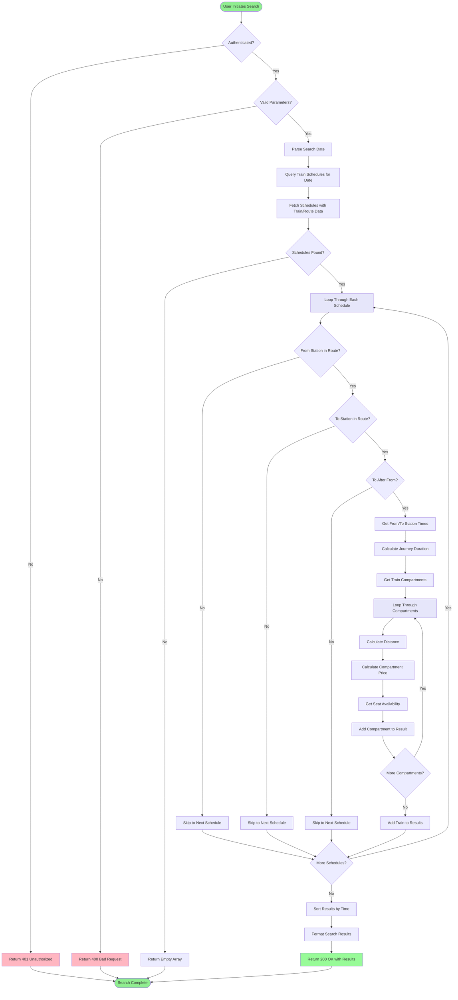

# RailNet Backend - UML and Activity Diagrams

This document contains comprehensive UML and activity diagrams for the RailNet backend system, created using Mermaid syntax.

## Table of Contents
- [Class Diagram (Database Schema)](#class-diagram-database-schema)
- [System Architecture Diagram](#system-architecture-diagram)
- [Authentication Flow](#authentication-flow)
- [Ticket Booking Flow](#ticket-booking-flow)
- [Payment Processing Flow](#payment-processing-flow)
- [Train Search Flow](#train-search-flow)
- [API Routes Component Diagram](#api-routes-component-diagram)

---

## Class Diagram (Database Schema)

This diagram shows the database models and their relationships using Prisma ORM.


---

## System Architecture Diagram

This diagram shows the high-level architecture of the RailNet backend system.


---

## Authentication Flow

This activity diagram shows the user authentication process including registration and login.


---

## Ticket Booking Flow

This activity diagram illustrates the complete ticket booking process with validation and seat management.


---

## Payment Processing Flow

This activity diagram shows the complete payment processing workflow with SSLCommerz integration.


---

## Train Search Flow

This activity diagram shows how users can search for available trains between stations.



---

## API Routes Component Diagram

This diagram shows the structure of API routes and their dependencies.


---

## Entity Relationship Diagram (ERD)

This diagram shows the relationships between database entities in a simplified format.

```mermaid
erDiagram
    USER ||--o{ TICKET : books
    USER {
        int id PK
        string email UK
        string firstName
        string lastName
        string phone
        string address
        string password
        string role
        datetime createdAt
        datetime updatedAt
    }

    STATION ||--o{ ROUTE_STATION : "previous"
    STATION ||--o{ ROUTE_STATION : "current"
    STATION ||--o{ ROUTE_STATION : "next"
    STATION ||--o{ TRAIN_ROUTE : "start"
    STATION ||--o{ TRAIN_ROUTE : "end"
    STATION ||--o{ SCHEDULE_STATION : includes
    STATION ||--o{ TICKET : "from"
    STATION ||--o{ TICKET : "to"
    STATION {
        int id PK
        string name UK
        string city
        float latitude
        float longitude
        datetime createdAt
        datetime updatedAt
    }

    TRAIN_ROUTE ||--o{ ROUTE_STATION : contains
    TRAIN_ROUTE ||--o{ TRAIN : uses
    TRAIN_ROUTE ||--o{ TRAIN_SCHEDULE : schedules
    TRAIN_ROUTE {
        int id PK
        string name UK
        int startStationId FK
        int endStationId FK
        datetime createdAt
        datetime updatedAt
    }

    ROUTE_STATION {
        int id PK
        int trainRouteId FK
        int previousStationId FK
        int currentStationId FK
        int nextStationId FK
        float distance
        float distanceFromStart
        datetime createdAt
        datetime updatedAt
    }

    COMPARTMENT ||--o{ TRAIN_COMPARTMENT : type
    COMPARTMENT {
        int id PK
        string name
        string class
        string type
        float price
        int totalSeats
        datetime createdAt
        datetime updatedAt
    }

    TRAIN ||--o{ TRAIN_COMPARTMENT : has
    TRAIN ||--o{ TRAIN_SCHEDULE : schedules
    TRAIN {
        int id PK
        string name
        string number UK
        int trainRouteId FK
        datetime createdAt
        datetime updatedAt
    }

    TRAIN_COMPARTMENT ||--o{ SEAT : contains
    TRAIN_COMPARTMENT ||--o{ TICKET : "booked-in"
    TRAIN_COMPARTMENT ||--o{ COMPARTMENT_BOOKING : tracks
    TRAIN_COMPARTMENT {
        int id PK
        int trainId FK
        int compartmentId FK
        int quantity
        datetime createdAt
        datetime updatedAt
    }

    SEAT ||--|| TICKET : assigned
    SEAT {
        int id PK
        int trainCompartmentId FK
        string seatNumber
        boolean isAvailable
        datetime createdAt
        datetime updatedAt
    }

    TRAIN_SCHEDULE ||--o{ SCHEDULE_STATION : "station-times"
    TRAIN_SCHEDULE ||--o{ TICKET : bookings
    TRAIN_SCHEDULE ||--o{ COMPARTMENT_BOOKING : tracks
    TRAIN_SCHEDULE {
        int id PK
        int trainId FK
        int trainRouteId FK
        datetime date
        string time
        datetime createdAt
        datetime updatedAt
    }

    SCHEDULE_STATION {
        int id PK
        int trainScheduleId FK
        int stationId FK
        string arrivalTime
        string departureTime
        int sequence
        datetime createdAt
        datetime updatedAt
    }

    TICKET ||--|| PAYMENT_TRANSACTION : payments
    TICKET {
        int id PK
        string ticketId UK
        int userId FK
        int trainScheduleId FK
        int fromStationId FK
        int toStationId FK
        int seatId FK UK
        int trainCompartmentId FK
        string seatNumber
        string passengerName
        int passengerAge
        string passengerGender
        float price
        string status
        string paymentStatus
        datetime expiresAt
        datetime confirmedAt
        datetime createdAt
        datetime updatedAt
    }

    PAYMENT_TRANSACTION ||--o{ PAYMENT_LOG : logs
    PAYMENT_TRANSACTION {
        string id PK
        int ticketId FK UK
        string transactionId UK
        string sessionKey
        float amount
        string currency
        string status
        string paymentMethod
        string bankTransactionId
        string valId
        string cardType
        datetime completedAt
        string gatewayUrl
        string errorMessage
        json metadata
        json sslcommerzData
        datetime createdAt
        datetime updatedAt
    }

    PAYMENT_LOG {
        string id PK
        string transactionId FK
        string action
        json details
        datetime createdAt
    }

    COMPARTMENT_BOOKING {
        int id PK
        int trainScheduleId FK
        int trainCompartmentId FK
        int bookedSeats
        int totalSeats
        datetime createdAt
        datetime updatedAt
    }
```

---

## Sequence Diagram: Complete Ticket Booking and Payment

This diagram shows the interaction between different components during the complete booking and payment process.


---

## Use Case Diagram

This diagram shows the various use cases and actors in the RailNet system.


---

## Deployment Architecture

This diagram shows how the backend system can be deployed in a production environment.


---

## Notes

- All diagrams are created using Mermaid syntax and can be rendered in GitHub, GitLab, or any Mermaid-compatible viewer
- The class diagram shows the Prisma schema with all relationships
- Activity diagrams illustrate the business logic flow for key operations
- Sequence diagrams show the interaction between components
- The system architecture provides a high-level overview of the backend structure
- Color coding is used to distinguish different types of components and outcomes

### Important Design Decisions

1. **Ticket-Seat Relationship (One-to-One with Unique Constraint)**:
   - The `seatId` field in the Ticket model has a unique constraint (UK), enforcing that each seat can only be assigned to one active ticket at a time
   - This prevents double-booking of seats for the same train schedule
   - When a ticket expires or is cancelled, the seat becomes available for booking again

2. **Ticket-PaymentTransaction Relationship (One-to-One)**:
   - Each ticket has exactly one payment transaction
   - The `ticketId` field in PaymentTransaction is unique, ensuring one-to-one mapping
   - This simplifies payment tracking and prevents multiple payment attempts for the same ticket

## How to Use These Diagrams

1. **In GitHub/GitLab**: These diagrams will render automatically in markdown preview
2. **In VS Code**: Install the "Markdown Preview Mermaid Support" extension
3. **Online**: Copy the mermaid code blocks to https://mermaid.live/ for interactive editing
4. **In Documentation**: These diagrams can be embedded in any documentation that supports Mermaid

## Diagram Maintenance

When updating the codebase, remember to update these diagrams:
- Add new models to the Class Diagram
- Update activity flows when business logic changes
- Reflect new routes in the API Routes diagram
- Update the architecture diagram when adding new services
